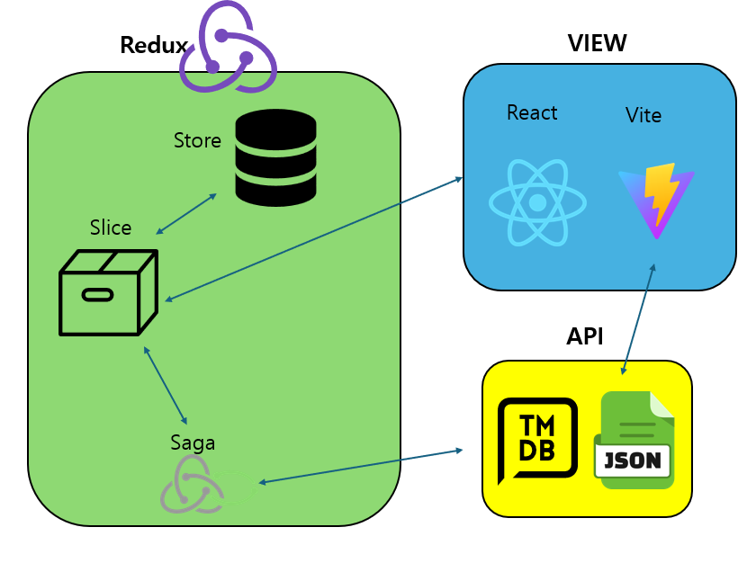
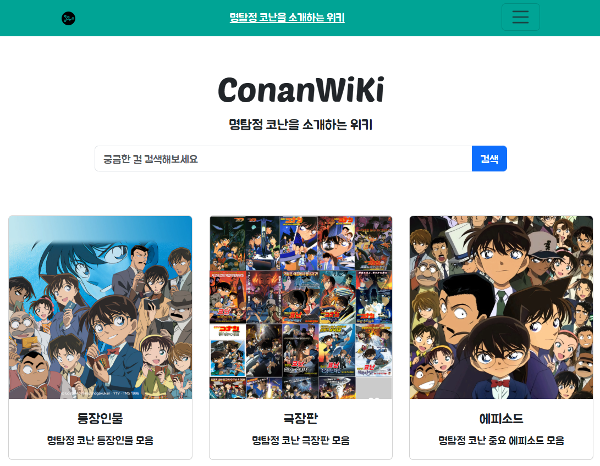
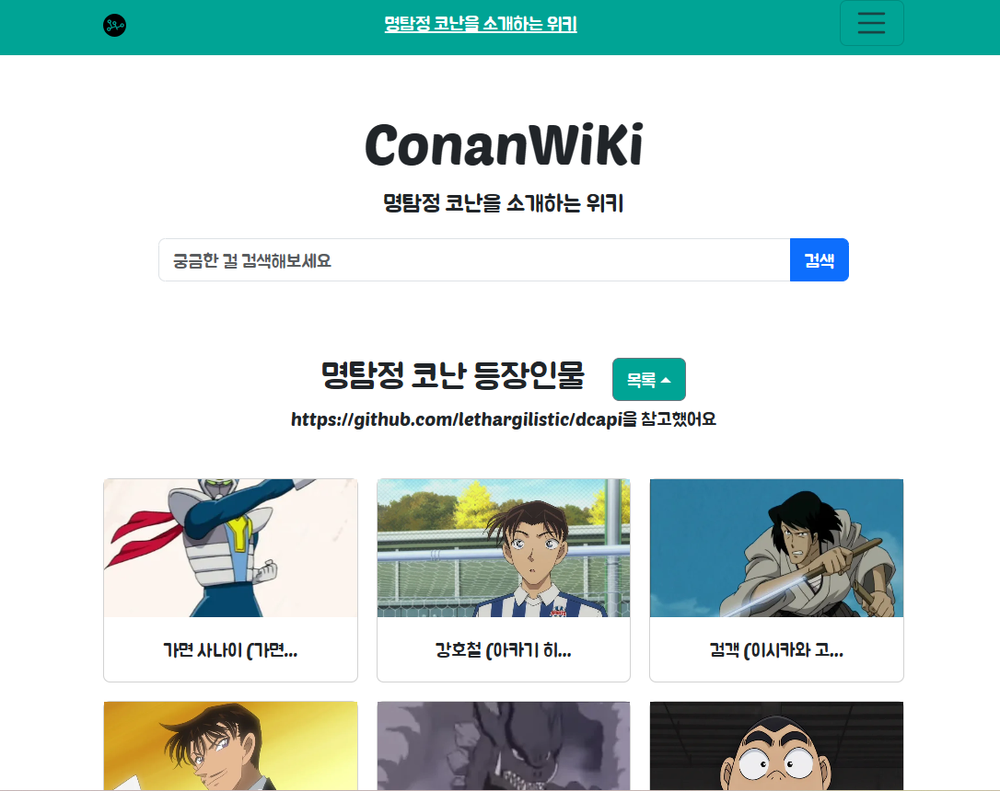
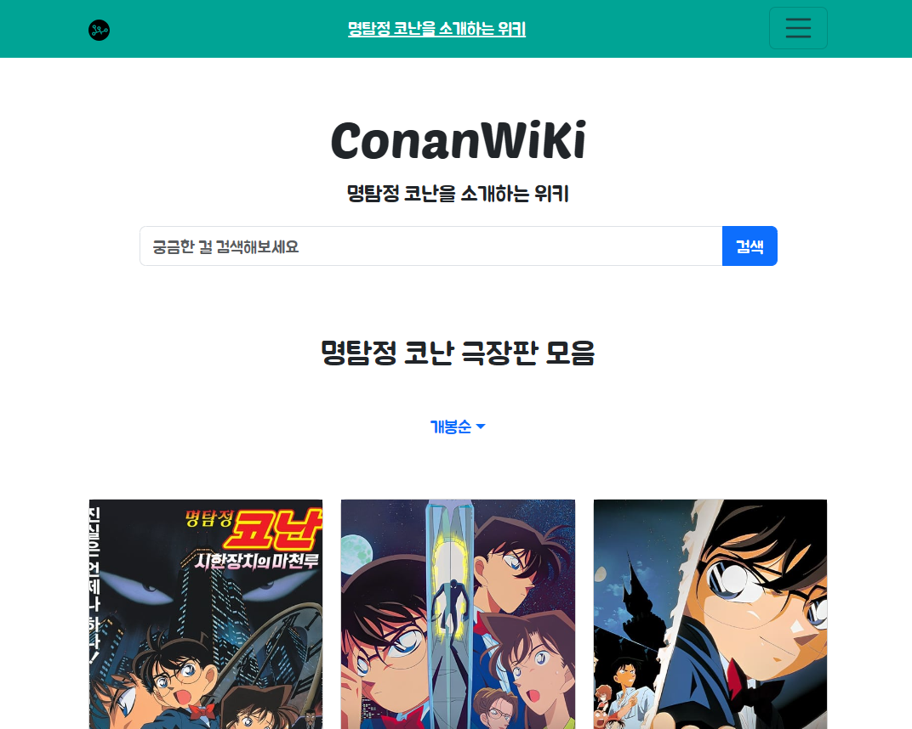
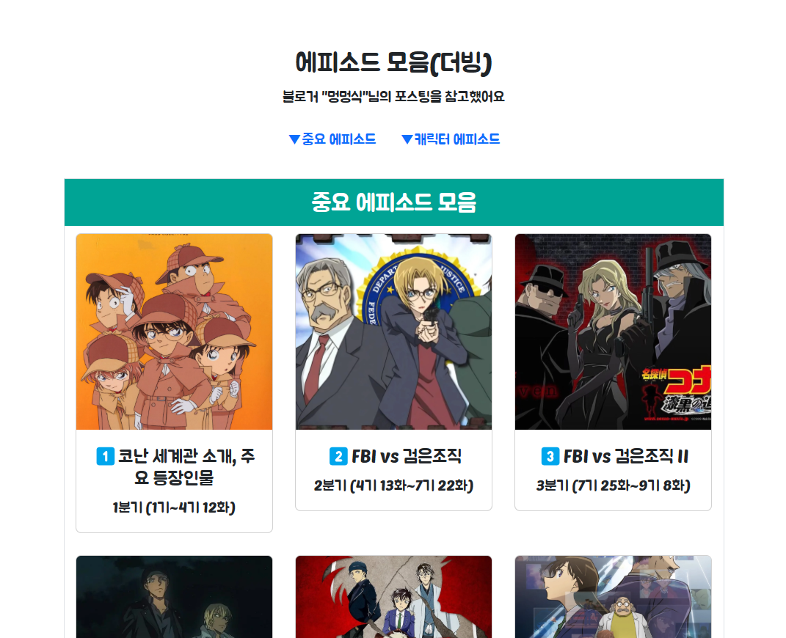

# `코난위키`

**명탐정 코난**을 소개하는 위키

🔗https://kimnambin.github.io/conanwiki/

<hr>

### 💻 사용기술

- Language & Library
<div>


</div>
<div>


</div>
<br>

- OTHER
<div>


</div>
<br>

- 사용 패키지

  - @reduxts/toolkit : RTK 사용

  - react-redux : redux hook 사용

  - react-router-dom : 페이지 전환용

  - react-bootstrap : 스타일 부트스트랩 사용

  - react-ioncs : 리액트 아이콘 사용

  - styled-components : 스타일 적용

  - typescript @types/react @types/react-dom : 타입스크립트 사용

<hr>

### 📃 아키텍처



---

### 📁 프로젝트 구조

```
├── build
│    ├── img
│    ├── couple.tson
│    ├── episodes.tson
│    ├── person.tson
│    ├── personEpisodes.tson
│    └── Jua-Regular.ttf
│
└── src
     ├── main.tsx
     ├── mainStyle.css
     │
     ├── component
     │     ├── App
     │     │     └──공통 컴포먼트
     │     ├── character
     │     │     └──등장인물 컴포먼트
     │     ├── episode
     │     │     └──에피소드 컴포먼트
     │     ├── movie
     │     │     └──극장판 컴포먼트
     │     │
     ├── api
     │     ├── characterApi.ts
     │     ├── episodeApi.ts
     │     └── movieApi.ts
     │
     ├── redux
     │     ├── store.ts
     │     └── slices
     │          ├── characterSlice.ts
     │          ├── episodeSlice.ts
     │          ├── modalSlice.ts
     │          └── movieSlice.ts
     ├── types
     │     ├── api.ts
     │     └── component.ts
     └──
```

---

### ⚠️ 기능

- 캐릭터 정보 (Character)

  - 캐릭터 목록
  - 캐릭터 디테일

- 극장판 정보 (Movie)

  - 극장판 목록
    - 개봉순 , 평점순 , 인기순 정렬
  - 극장판 디테일

- 정주행 에피소드 추천 (Episode)

- 검색
  - 캐릭터 , 극장판 검색 가능

---

### 🖋️ 사용자 시나리오

| 이름            | 시간 | 비고                                             |
| --------------- | ---- | ------------------------------------------------ |
| 메인 페이지     | 15초 | 웹 사이트 탐색                                   |
| 검색            | 10초 | 등장인물이나 극장판 검색 및 결과 확인            |
| 캐릭터 페이지   | 20초 | 명탐정 코난 등장인물 확인                        |
| 극장판 페이지   | 30초 | 명탐정 코난 극장판의 개봉일 , 평점 , 인기순 확인 |
| 에피소드 페이지 | 15초 | 명탐정 코난 주요 에피소드 확인                   |
| Readme 확인     | 10초 | 만든 과정 확인                                   |

---

### 📱 주요 화면

|            메인 페이지             |
| :--------------------------------: |
|  |

|                   캐릭터                    |
| :-----------------------------------------: |
|         |
|  |

|                   극장판                    |
| :-----------------------------------------: |
|           |
|  |

|                  에피소드                   |
| :-----------------------------------------: |
|       |
|  |

|                검색                 |
| :---------------------------------: |
|  |
