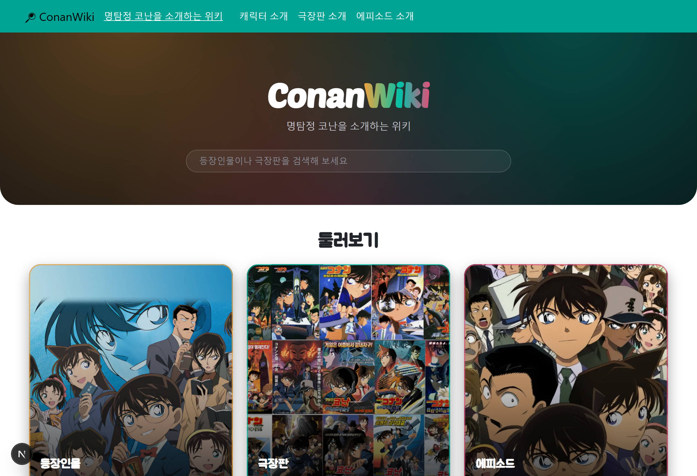
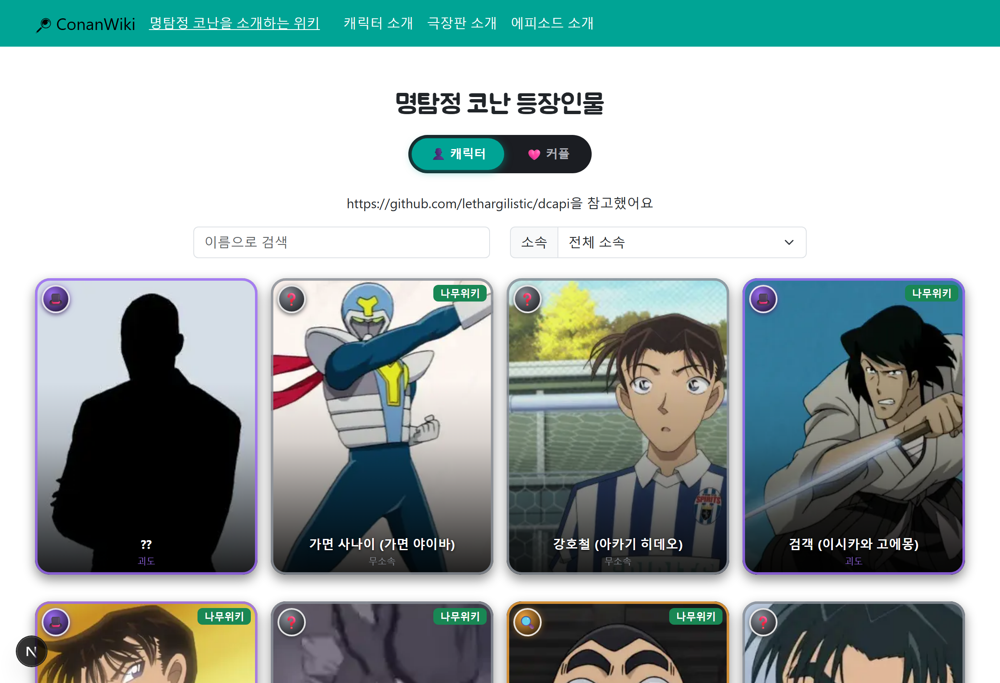
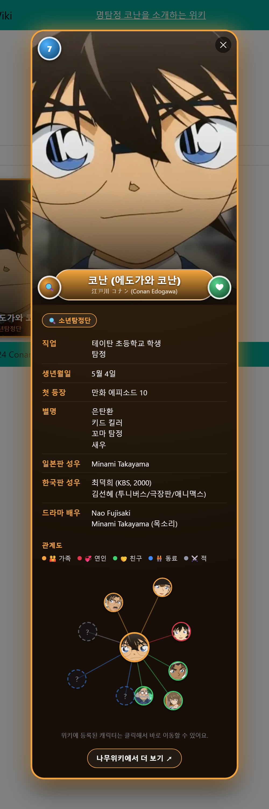
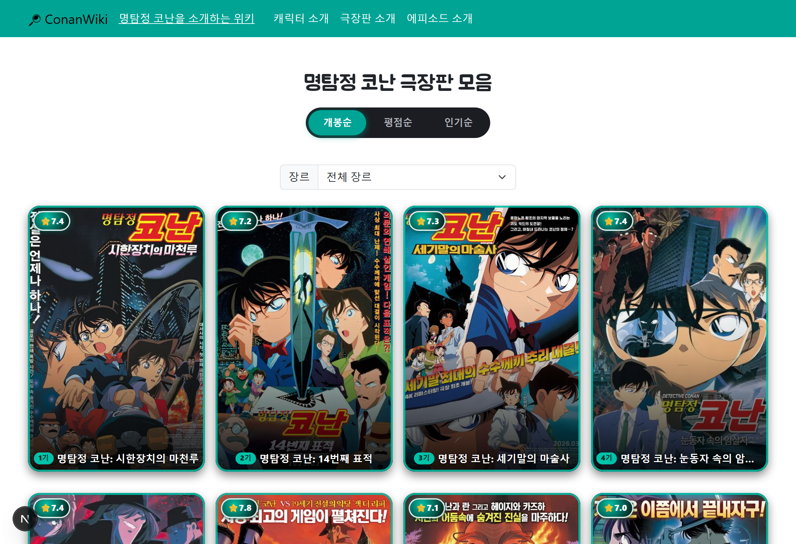

# `코난위키`

**명탐정 코난**을 소개하는 팬 위키

🔗 https://conanwiki.vercel.app

[](https://github.com/kimnambin/conanwiki/actions/workflows/ci.yml)

<hr>

### 📱 주요 화면

|                   메인                    |                  캐릭터 목록                   |
| :----------------------------------------: | :---------------------------------------------: |
|  |  |

|              캐릭터 상세 + 관계도               |                   극장판                    |
| :----------------------------------------------: | :------------------------------------------: |
|  |  |

<hr>

### ⚠️ 기능

- **캐릭터 정보** — 목록/검색/소속 필터, 하스스톤 카드 스타일 상세 모달
- **관계도 시각화** — 캐릭터의 가족·연인·친구·동료·적 관계를 방사형 그래프로 보여주고, 위키에 등록된 인물은 클릭해서 바로 그 캐릭터로 이동할 수 있어요
- **극장판 정보** — TMDB 연동, 개봉순/평점순/인기순 정렬, 장르 필터, OTT 시청 링크
- **정주행 에피소드 추천**
- **통합 검색** — 캐릭터·극장판을 한 번에 검색
- **PWA** — 홈 화면에 설치해서 앱처럼 쓸 수 있고, 오프라인에서도 마지막으로 본 페이지를 볼 수 있어요

---

### 💻 기술 스택

<div>


</div>
<br>
<div>


</div>
<br>
<div>


</div>

- **App Router (`src/app`)** — 캐릭터/극장판 데이터는 서버 컴포넌트에서 미리 읽고, 검색·필터·모달 같은 상호작용만 클라이언트 컴포넌트로 분리
- **PWA** — `manifest.ts` + `public/sw.js`(네트워크 우선, 정적 리소스 캐시) + 설치 버튼 컴포넌트
- **테스트** — Vitest를 세 프로젝트로 나눠서 씀
  - `unit`: 순수 로직(캐릭터 타입 분류, 관계도 파싱/레이아웃) — Node 환경
  - `component`: React Testing Library로 실제 상호작용(호버/키보드/바깥 클릭) 검증 — 브라우저 환경
  - `storybook`: `@storybook/addon-vitest`로 스토리를 그대로 인터랙션 테스트로 실행
- **CI** — PR/main 푸시마다 lint·타입체크·테스트(+커버리지)·프로덕션 빌드·Storybook 빌드를 GitHub Actions로 자동 실행

---

### 📁 프로젝트 구조

```
src/
├── app/                    # Next.js App Router 라우트
│   ├── characters/
│   ├── movies/[id]/
│   ├── episodes/
│   ├── offline/            # PWA 오프라인 폴백 페이지
│   ├── layout.tsx
│   ├── manifest.ts         # PWA 웹 매니페스트
│   ├── sitemap.ts / robots.ts
│
├── component/
│   ├── app/                 # 네비바, 검색, PWA 설치 버튼 등 전역 컴포넌트
│   ├── character/            # 캐릭터 카드/상세 모달/관계도 그래프
│   ├── common/                # ToggleSwitch, GemHint 등 재사용 UI
│   ├── episode/
│   └── movie/
│
├── api/                     # TMDB API 호출 (서버 전용)
├── data/                     # person.json 등 캐릭터/에피소드 정적 데이터
├── types/
└── utils/                     # 캐릭터 타입 분류, 관계도 파싱/레이아웃 등 순수 함수

.storybook/                  # Storybook + Vitest 브라우저 모드 설정
public/
├── icons/                    # PWA 아이콘
├── sw.js                     # 서비스워커
scripts/
└── generate-pwa-icons.mjs   # 파비콘 이미지 → PWA 아이콘 세트 생성 스크립트
```

---

### 🖋️ 사용자 시나리오

| 이름            | 시간 | 비고                                             |
| --------------- | ---- | ------------------------------------------------ |
| 메인 페이지     | 15초 | 웹 사이트 탐색                                   |
| 검색            | 10초 | 등장인물이나 극장판 검색 및 결과 확인            |
| 캐릭터 페이지   | 30초 | 등장인물 확인 후 관계도를 따라가며 다른 인물로 이동 |
| 극장판 페이지   | 30초 | 명탐정 코난 극장판의 개봉일 , 평점 , 인기순 확인 |
| 에피소드 페이지 | 15초 | 명탐정 코난 주요 에피소드 확인                   |
| 앱 설치         | 5초  | PWA로 홈 화면에 설치                             |

---

### 🛠️ 로컬에서 실행하기

극장판 정보는 [TMDB](https://www.themoviedb.org/) API를 쓰므로, `.env.local`에 `TMDB_API_KEY`를 넣어야 해요. (CI에서 빌드가 되려면 저장소 Actions Secrets에도 동일한 키를 등록해야 합니다.)

```bash
npm install
npm run dev              # http://localhost:3000

npm run lint              # ESLint
npx tsc --noEmit          # 타입 체크
npm run test:coverage     # Vitest (unit + component + storybook) + 커버리지
npm run storybook         # http://localhost:6006
npm run build              # 프로덕션 빌드
```
